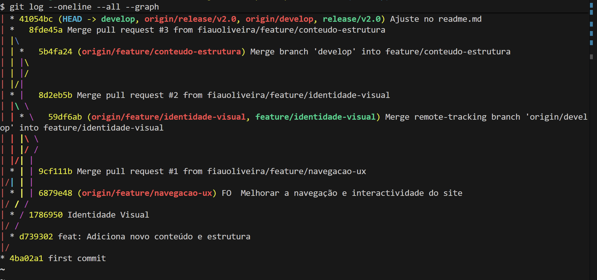

# Portal SETIC

Portal web do Serviço de Tecnologias de Informação e Comunicação das Finanças Públicas.

---

## 📦 Versão

**v2.0**  
Data de lançamento: 2026-01-22

---

## 📝 Changelog

### v2.0
- Melhoria da estrutura do projeto
- Organização dos ficheiros CSS e JavaScript
- Ajustes visuais e pequenos refinamentos no site
- Correções gerais identificadas durante testes

### v1.0
- Estrutura inicial do portal
- Página principal com HTML básico
- Configuração inicial do projeto

---

  

## 📁 Estrutura do Projecto

